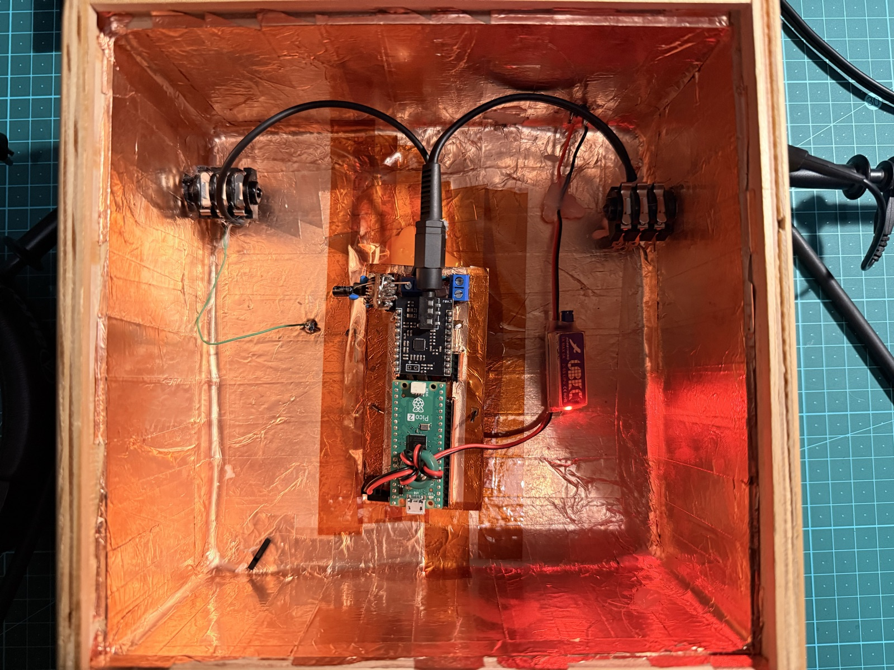

Episode 1 ended with the algorithm working — offline, on embedded audio, the Pico 2 spitting out a microphone-like file over UART. The closing line promised *first live audio through the prototype*. This is that episode.

**Before / after, real guitar through the real pedal:**

<audio controls>
  <source src="assets/garrison-passthrough_cc.mp3" type="audio/mpeg">
  <a href="assets/garrison-passthrough_cc.mp3">Garrison piezo, transparent passthrough through the pedal — no IR (59s)</a>
</audio>

<audio controls>
  <source src="assets/garrison-ir_cc.mp3" type="audio/mpeg">
  <a href="assets/garrison-ir_cc.mp3">Same guitar, same pedal, same passage — 512-tap NT1-A IR applied (59s)</a>
</audio>

The nasal quack — the thing piezo pickups get blamed for and the entire reason this project exists — is gone. The signal sounds like a recorded acoustic guitar instead of an under-saddle pickup.

That's the headline. The rest of this post is how a six-week build got from *Episode 1's offline algorithm* to *the pedal in the gift box that produced those recordings*.

---

## The Pedal


That's the V1 build. The enclosure is a repurposed multilingual gift box — "dankie / THANK YOU / Enkosi kakhulu" — copper-tape-lined on the inside for shielding, with TRS panel jacks on opposite walls and a 9V battery snap inside. The brain is a Raspberry Pi Pico 2 + a PCB Artists ES8388 codec module + a small JFET daughter board buffering the piezo's high-impedance signal.



The signal chain:

```
Guitar TRS  →  JFET source-follower (high-Z buffer)  →
  ES8388 LIN2 (ADC, +18 dB PGA)  →
    Pico 2 RP2350 (I²S DMA capture)  →
      FFT convolution against NT1-A acoustic IR  →
    Pico 2 → ES8388 DIN (I²S DMA playback)  →
  ES8388 LOUT1 (40 mW headphone amp)  →
Guitar TRS  →  PA / headphones / recording interface
```

End-to-end latency: 7.1 ms. Under the 10 ms threshold above which guitarists start to *feel* the delay between strumming and hearing the result. The whole chain runs on one 9V battery for hours.

---

## Why SNR Matters Before IR Matters

Here's something nobody mentioned upfront: FFT convolution amplifies noise alongside signal. If your front end hisses, the IR makes it hiss with body resonance. The "make piezo sound like microphone" hypothesis isn't worth testing on a noisy chain — because the result is just *a noisier-sounding miked guitar*.

So the first half of the build was getting the SNR right. Three shielding levers stacked, measured against a signal-injector dongle for repeatable testing:

| Configuration | LOUT noise floor | SNR @ −10 dB input |
|---|---|---|
| Open-board breadboard (no enclosure) | 29 mV, peak at 9.87 kHz (MCLK leakage) | ~11 dB |
| In-box battery (copper-tape-lined enclosure) | 19 mV broadband | 30 dB |
| V2 rebuild (+ top-side ground plane, twisted-pair clock drains) | **6 mV broadband, no clock peaks** | **40 dB** |

That third row matters: the FFT of the noise floor went from "obvious 12 kHz MCLK spike sticking out by 15 dB" to "flat broadband with no discrete peaks." The clock-leakage that breadboard prototypes universally suffer from — the price you pay for running 12 MHz digital signals next to mV-level analog — was gone.

That clears the runway for the IR to do tonal work instead of amplifying digital crud.

---

## The Bug That Looked Exactly Like a Dead JFET

Somewhere in the SNR session, the JFET stage stopped working. DC bias measurements looked perfect — V_S = 3.9 V, V_GS = −1.4 V, textbook for the 2SK30A-GR — but the AC signal collapsed by 22 dB. V_S at 26 mV instead of the expected ~290 mV.

This is the *signature* of a heat-damaged JFET: DC operating point intact (the channel still conducts), small-signal gm gone (the convolutional gain that lets it follow AC signals). I spent two hours on that hypothesis. Tin-can shielding wrap had been done recently and was a plausible thermal stressor; the chip is fragile small-die silicon; I had nine spares from the Mantech batch and was preparing to swap.

Then a 10-second DMM check on the wrong-looking node caught it: pin 1 of the daughter (the bias-divider midpoint) read 0 V instead of the design 1.65 V. With pin 1 at AC ground, the 10 µF coupling capacitor was shunting the source-follower's AC swing straight to ground through ~16 Ω of capacitive impedance. The JFET was fine; it was being shorted into uselessness *after* its output.

Why was pin 1 at 0 V? The bias-divider's lower resistor — supposed to be 100 kΩ — was 100 Ω. A wrong-by-1000× resistor.

Not a colour-band misread, though — I'm colour blind, so I don't trust the bands at all. I meter every resistor as I place it, and I metered this one. The slip was subtler: I read the digits and missed the *exponent*. 100 Ω and 100 kΩ both register as "1-0-0" if you're not watching the multiplier, and that's the trap I walked straight into.

What normally saves me is procedure. A bias divider is a *pair*, and I usually fit and measure both resistors together — so a 1000× mismatch between them is glaring the moment they sit side by side. This time the build order split them: I fitted one resistor, did other work, and fitted the second much later. The two were never compared, so the magnitude slip had nothing to contradict it.

Two engineering takeaways went into the build procedure permanently:

1. **Fit and measure both halves of a bias divider in one sitting, and read the exponent — not just the digits.** Metering each resistor individually doesn't help when the failure mode is a 1000× magnitude slip; it's the *comparison across the pair* that catches it.
2. **When DC bias looks perfect but AC signal collapses, test the bias-node DC at every accessible point before suspecting silicon damage.** A short *after* the active device can perfectly mimic a dead active device.

The pedal in the photo above is the rebuilt one, post-fix. (The original V1 pedal was destroyed by an unrelated incident — a scope probe shorted the 5 V rail to GND during debugging and killed the RP2350. That's its own engineering story for another post.)

---

## The IR Splice

With the signal chain quiet and the JFET vindicated, the actual code change to add IR convolution was three pieces glued into the existing test binary:

```cpp
// Top of audio/es8388_test.cpp
#include "FFTConvolver.h"
#include "audio/samples/ir_array_tanglewood.h"

#define IR_TAPS         512       // single-core fit on RP2350 HW FPU
#define IR_OUTPUT_SCALE 0.5f      // tuned by listening test

static fftconvolver::FFTConvolver s_convolver;
static float s_ir_buf[IR_TAPS];
static float s_dsp_in [I2S_BLOCK_SIZE];
static float s_dsp_out[I2S_BLOCK_SIZE];
```

```cpp
// Inside the DMA IRQ handler — between ADC capture and DAC writeback
for (int j = 0; j < I2S_BLOCK_SIZE; j++) {
    int32_t l_raw = src[j * 2] << 1;          // sign-recovery from PIO
    s_dsp_in[j] = (float)l_raw * (1.0f / 2147483648.0f);  // int32 → [-1, 1)
}

s_convolver.process(s_dsp_in, s_dsp_out, I2S_BLOCK_SIZE);

for (int j = 0; j < I2S_BLOCK_SIZE; j++) {
    float f = s_dsp_out[j] * IR_OUTPUT_SCALE;
    if (f >=  1.0f) f =  0.999999f;
    if (f <  -1.0f) f = -1.0f;
    int32_t l = (int32_t)(f * 2147483648.0f);
    s_staging_buf[j * 2]     = l;
    s_staging_buf[j * 2 + 1] = l;
}
```

The IR is currently truncated to 512 of its native 2048 samples — enough to fit in ~30% of the IRQ time budget on a single core, capturing direct sound plus early reflections. The full 2048-tap IR (the late reverberant tail) needs a Core 1 worker via the `TwoStageFFTConvolver` — already implemented for the offline test, deferred for migration once the test binary becomes the canonical pipeline. The point of this round was to validate that the IR is musically transformative, not to ship the fastest possible implementation.

512 taps already delivers the headline result.

---

## What the IR Is Actually Doing

This is the visual evidence — the *long-term-average spectrum* of the same recordings the audio embeds above came from, with the pedal in IR-off (orange) vs IR-on (blue) modes. The green dashed curve is the difference: literally the IR's filter shape, in dB per frequency.


Read the green ΔIR curve and you can see the IR doing three things:

- **Low-mid boost around 200–400 Hz** — adding the body resonance the under-saddle piezo physically cannot capture
- **Cut in the 1–4 kHz region** — taming the harsh formants that produce the "quack"
- **Top-end roll-off** — softening the brittleness of direct-pickup high frequencies

That's the recipe for "make piezo sound like miked acoustic," visualised. Pre-recorded as a 512-tap array of floats, applied 187 times a second inside a DMA interrupt handler on a $7 microcontroller.

---

## Where We Are

The V1 audio milestone is done. The pedal works. Hypothesis from Episode 1 — "Can a $7 chip sound like a $300 microphone?" — answered: **yes, it can**, on real hardware with a real guitar plugged in, on a 9V battery, in a wooden gift box.

What's next, in rough order:

- **Migrate the IR path from the test binary into the canonical dual-core pipeline.** Unlocks the full 2048-tap IR + room for downstream DSP stages.
- **Three more DSP features identified during the listening test:** a touch of post-IR EQ, a low-mid "shoulder" treatment (the ~200–500 Hz band still wants gentle dynamic control), and a compressor to tame the residual piezo transient spikes.
- **UI hardware:** OLED + rotary encoder + SD card for swapping IRs and storing presets. The hooks are already on the perfboard.
- **An OPA1642A op-amp daughter board** to replace the JFET buffer — better low-end response, simpler bias, addresses a measurable ~200 Hz roll-off in the current chain.
- **A KiCad PCB** to retire the perfboard once the V1.1 software polish has settled.

Plenty more to build. But the question that opened Episode 1 has its answer, and it sounds like a microphone.