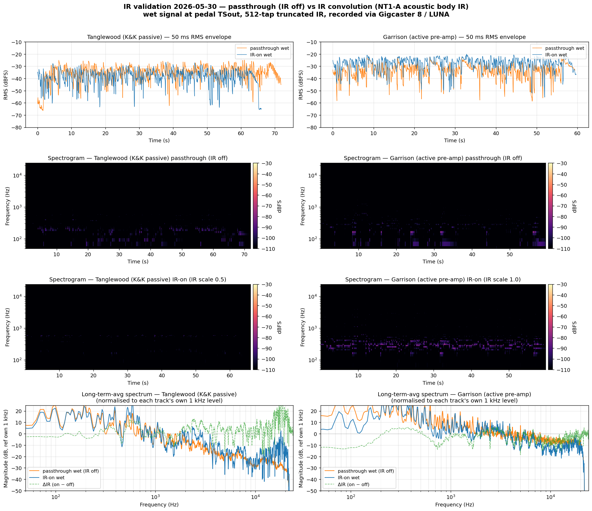

The first two episodes were an idea and a bench. An algorithm that turned a $7 codec chip into something that sounds like a $300 microphone, then the first live audio proving it works on real hardware.

This one is the part a build project is actually *for*: playing music through it.

  <iframe src="https://www.youtube.com/embed/BtMPneFSfpQ" title="Building a DIY acoustic guitar pedal for great tone" allow="accelerometer; autoplay; clipboard-write; encrypted-media; gyroscope; picture-in-picture" allowfullscreen></iframe>

The whole build story, start to finish — and at the end, the thing doing its real job: an acoustic guitar, a piezo pickup, and a wooden gift box full of electronics making it sound like it was recorded in a studio.

---

## Why This Is the Milestone

Episode 2 proved the sound in a controlled test — record a passage, apply the IR, compare. This is the step that test can't stand in for: **it held up as an instrument.** Plugged in, on battery, latency you don't feel, and it just *worked* through a full take — no bench, no laptop, no measuring rig. That's the line between "a circuit that produces the right output" and "a pedal you'd actually put on the floor and play."

Everything under the hood that made it possible has its own episode:

- **[Episode 1 — Can a $7 chip sound like a $300 mic?]({{ '/episodes/2026-04-can-a-7-dollar-chip-sound-like-a-300-dollar-mic/' | relative_url }})** — the idea, and the offline proof.
- **[Episode 2 — IR Killed the Quack]({{ '/episodes/2026-05-ir-killed-the-quack/' | relative_url }})** — the impulse-response convolution that removes the nasal piezo "quack," with before/after audio.

---

## What's Next

The front end that buffers the piezo is getting an upgrade — an **op-amp daughter board** in place of the original JFET, for a cleaner low end and simpler tuning. That's a short technical follow-up coming next. And the pickup this was really built for, a passive K&K, is still to be put through it.

For now: it plays.

---

Source, schematics, and firmware: [github.com/dylangmiles/pico-tone-trixter](https://github.com/dylangmiles/pico-tone-trixter)
