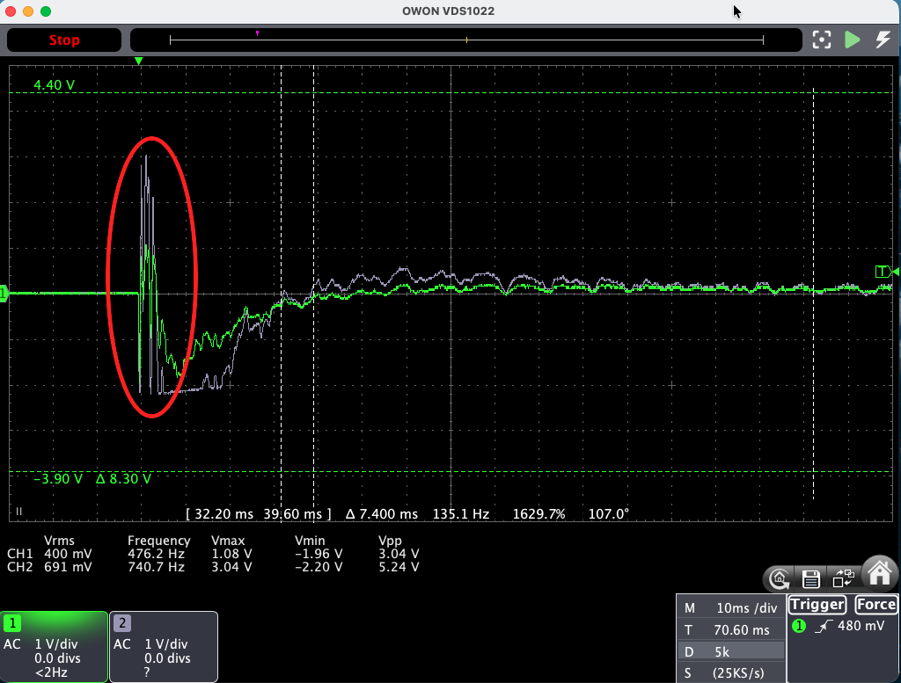
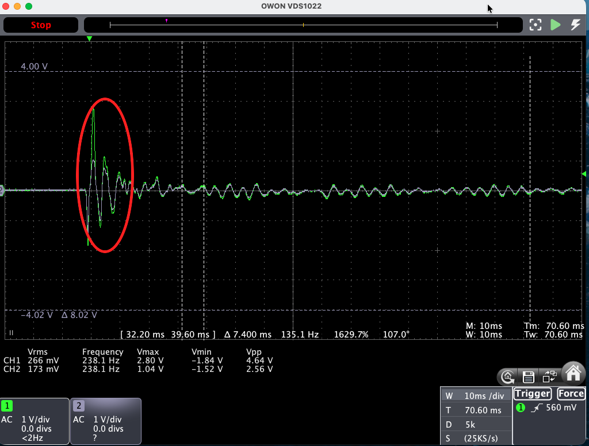

Episode 2 closed with a to-do list. Top of it: replace the JFET buffer that conditions the piezo signal with an **op-amp daughter board** — cleaner, quieter, simpler to tune. I was sure it was the upgrade.

This is that swap. It's also the story of measuring it honestly and watching the plan turn inside out.

---

## What a Front End Even Does

A piezo pickup makes a tiny, fussy signal — millivolts, at a very high impedance. Before anything else can touch it, one small circuit has to *catch* it: present a high enough input impedance that it doesn't load the pickup down, add as little noise as possible, and keep enough headroom not to distort on the loud bits. That circuit is the **front end**, and every clever thing downstream — the impulse response, the EQ, the compressor — is only ever as good as what the front end hands it.

The original catcher was a single JFET. The plan was to replace it with something better.

## The Board

Half of an **OPA1642** — a FET-input audio op-amp — wired as a single-5 V-rail preamp with +6 dB of gain. FET input because the K&K piezo needs a ≥1 MΩ high-impedance load. It drops into the exact same socket as the JFET, so the whole thing is a straight A/B swap: pull one daughter, push the other.

## Three Bugs in One Build

First power-up, the output slammed to the rail and stayed there. The fix came from walking the DC voltages across the chip's own pins, one at a time — which turned up two faults stacked on top of each other: a **missing feedback resistor** (no feedback, so the amp rails), and once that was in, a **solder bridge shorting the inverting input to ground** (input pinned low, so the amp rails *again*). Clear both and the output snapped to a clean mid-rail.

Debugging by measuring the nodes instead of guessing at them — the recurring theme of this whole project, and the reason the rest of this episode exists.

## Threading the Needle

Here's the thing I had backwards.

The K&K has a brutal dynamic range. A sustained note is a few millivolts. A knuckle-tap on the guitar body — the kind of percussion players use all the time — spikes to nearly **two volts**. The signal has to pass through a narrow window: above the noise floor so you can hear it, below the converter's clipping ceiling so it doesn't distort. Thread that needle and the pedal sounds like the room. Miss it and you get hiss or crunch.

I'd assumed the buffer set the top of that window. So I measured where the converter actually clips — the real full-scale voltage at its input. It's **1.35 volts.** That's the eye of the needle, and it's set by the chip you're *feeding*, not the one doing the feeding. A hard body-tap at ~2 V doesn't overload the buffer — it overloads the **converter**, and no buffer in front of it changes that number.

That reframed everything. The front end isn't one component doing a job; it's a chain — pickup, buffer, gain stage, converter — and the signal only gets through clean when every link lines up. Ducks in a row. Worse, the op-amp's +6 dB of gain — the thing I'd been so pleased with — *shrinks* the window: it hands the converter a hotter signal, so it clips **sooner**. The gain I'd added was working against me.

## The Same Tap, Two Ways

Here's what that looks like on the bench. A hard tap on the guitar body through each front end — the sort of percussion players do without thinking. Green is the pickup going in, the pale trace is what the front end sends on, and the red ring marks the instant of the tap.

**The op-amp first.** Three volts peak-to-peak going in. What comes out measures **5.24 V pp — on a 5 V rail.** Inside the ring the output isn't a peak at all, it's a flat edge, pinned hard against both supplies. Those peaks aren't loud. They're *gone*, chopped off into crackle.

**Now the JFET — and I fed it a *harder* tap.** 4.6 V peak-to-peak going in, half as much again as the op-amp got. Its output still comes out bounded, at 2.6 V pp. Inside the ring you can see the green input spiking well past the pale output: the biggest peak eased down rather than chopped off. More energy in, less chaos out.

And the loudest thing I could throw at it — a very hard thumb strum — the JFET still holds together, easing the biggest peaks down gently instead of slamming them flat:

That's the headroom column of the scorecard, in three pictures — and it's the part that surprised me most, because it's the *cheaper* part doing the better job.

## The Op-Amp's Dirty Secret

Then the buffer itself gave something away. Feeding it a clean test tone, the output came back visibly lopsided — nearly **9% distortion**, at small, quiet signal levels where nothing should be straining.

A FET-input op-amp has an input "common-mode range" — a band of voltages its inputs are actually specified to work across. On a single 5 V rail, biased at mid-rail, ours sits about a volt *outside* that band. It works, in the sense that sound comes out. But it's running off-spec, and the distortion is the receipt. The JFET, handed the identical tone: **0.6%.** The fancy part was quietly breaking the rules; the humble one wasn't.

## The Noise Measurement I Owed You

Last episode I promised this one. The bench scope couldn't see either front end's noise floor — both sit below the scope's *own* noise — so I said it was a soundcard-and-FFT job for another day.

This is that day. And the answer settled the whole thing.

Intrinsically, **the JFET is the quieter part** — its broadband hiss runs 8 to 14 dB *below* the op-amp's, right across the audio band. The op-amp's one advantage is less mains hum, and that traces to the JFET's very-high-impedance input picking up more of the 50 Hz in the air — a shielding-and-grounding fix, not a reason to change chips.

And one more result closed the door on my premise for good: turning *up* the codec's own gain buys no quiet at all, because the noise rides straight up with the signal. You don't get a lower floor by amplifying harder before the converter. The only thing that lowers it is a genuinely quieter buffer.

## The Scorecard

Four things decide this front end: **headroom, distortion, hiss, hum.**

| | Headroom | Distortion | Hiss | Mains hum |
|---|:---:|:---:|:---:|:---:|
| **JFET** | ✅ | ✅ | ✅ | ✗ *(fixable)* |
| **Op-amp** | — | — | — | ✅ |

The JFET — the part I set out to *replace* — wins three of the four. The op-amp takes only the hum, and that one's a grounding problem I can design out. I built Plan B certain it was the answer, and the measurements walked me straight back to Plan A, understood far better than when I left it.

## Where the Gain Goes

That last result had a corollary, and it took another session at the bench to find it.

If turning up the codec's own gain buys no quiet — because the noise rides up with the signal — then it looks like nothing can improve the noise floor except a better buffer. That's true of every gain control *inside* the pedal. It isn't true of the one that sits outside it.

The active-pickup guitar has its own volume knob, and that knob sits ahead of the pedal's entire front end: ahead of the buffer, ahead of the converter, ahead of the place the noise is actually born. Turn it up and the signal rises **without the pedal's noise rising with it.**

Going from half to three-quarters put **10.4 dB more signal in and only 2.1 dB more noise** — a real **8.4 dB of signal-to-noise, free.** That is more than the entire difference between the two buffers I'd spent this whole episode comparing. Past three-quarters it buys another 2 dB and starts clipping the converter, so three-quarters is where it lives now.

It's one of the oldest rules in audio — get your level early, before anything has had a chance to add noise — and I'd spent weeks trying to buy it with the wrong knob.

## And the Needle?

The number that started all this was 1.35 volts, where the converter clips. The thing that was supposed to blow straight through it was a hard tap on the guitar body — nearly two volts on the passive K&K, with half a volt of overshoot and nowhere to put it.

So with the JFET in place and the codec's gain at zero, I went back and measured the most violent thing this pickup ever sees: a very hard tap right by the bridge.

It lands at **exactly full scale. Not one clipped sample.**

The window turned out to be precisely wide enough. Not by design — by measurement, after a wrong turn and back again.

There's a twist in that, though. The JFET's bias is *wrong*: it sits higher than it should, which quietly squashes the positive half of a big transient before the converter ever sees it. That defect is on my list to correct. It also appears to be exactly what's saving those taps. So "fixing" it might cost me the thing I just measured — which is a strange and slightly funny place to end up, and a reason to put a scope on it before I reach for the soldering iron.

## Where We Are

The JFET is the front end. That's not where I expected this to land, and it's exactly why you measure instead of assume — the fancy part isn't automatically the better one, and the ceiling isn't always where you think it is.

The levels are now re-tuned around it: every preset dialled on the bench for both the passive K&K and the hot active pickup, the codec's gain pinned at zero for good, and all the make-up moved to *after* the converter where it costs nothing. Along the way the compressor had to learn a job it never used to do — the converter's clipping had been quietly acting as the peak limiter all along, and taking that away meant the compressor had to actually catch the transients itself.

There's a number attached to all of this, and it's the one I've been chasing since the first breadboard.

Back in May, boxed up and running off a battery, the pedal measured **30 dB**. Today it measures **51 dB.**

Two honest footnotes on that jump. The first is that the May number was taken a slightly different way — signal against noise at one particular playing level, rather than the full range from the loudest thing the chain accepts down to its own hiss. Put on the same footing as everything since, May comes out at **28 dB**, so the real gap is a touch *wider* than the chart shows.

The second matters more. That improvement sounds like a victory over noise, and it isn't. Only about **3 dB** of it came from the pedal actually getting quieter. The other **19 dB** came from *headroom* — from no longer throwing away most of the converter's range before the signal even arrived. Which is the same lesson as everywhere else in this episode: the win was in where things sat, not in what they were made of.

Strip out the mains hum that the shielding is meant to deal with, and the same measurement already reads about **70 dB**. That's the next number to go and earn — and it puts the dashed bar on that chart within reach of a board I haven't built yet.

Next: rebuild the JFET daughter board *properly* — a wider supply rail for margin, a corrected bias for symmetric headroom, and shielding for that mains pickup. Quite possibly on the first real circuit board of the project. Same needle; steadier hands.

---

Source, schematics, and firmware: [github.com/dylangmiles/pico-tone-trixter](https://github.com/dylangmiles/pico-tone-trixter)
