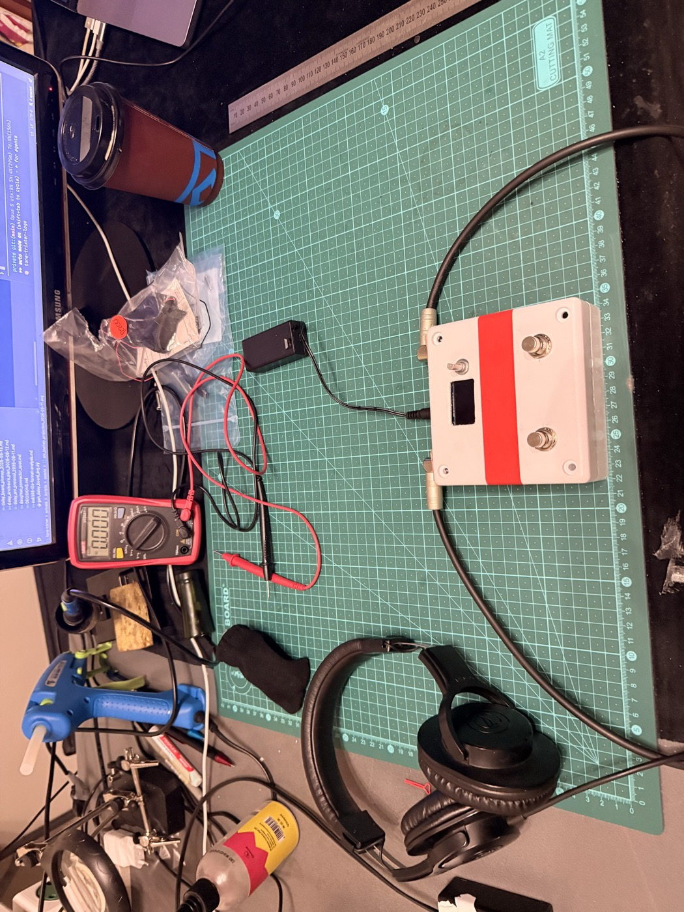

Every episode of this log has had the same graph hiding in it somewhere: how far above its own noise the pedal can hear a guitar. Breadboard, first prototype, the box, the re-staging — one number per board, each one higher than the last. This episode is about what happened when I added the new board to that graph, and then about what happened when I stopped believing it.

---

## Thirty Decibels That Didn't Show

Episode 5 ended with a new brain on the bench: a Daisy Seed, built around a converter far quieter than the one the pedal had been using. The op-amp front end from that episode went in ahead of it, on 9 volts, at unity gain. Everything the last two episodes argued for, on one board.

The first honest measurement of it went like this. Short the input — plug a cable in and short the far end, so the pedal is listening to nothing at all — and record what comes out. **−92 dBFS.** That is essentially the floor of the audio interface doing the recording. The pedal's own electronics had dropped below what I can measure.

Then unplug the short and plug in the signal cable, with nothing playing on it. **−61 dBFS.**

Thirty-one decibels of difference, from connecting a cable. Every bit of it was below 200 Hz, and a spectrum showed exactly what it was: 50 Hz and its harmonics. The mains. The pedal was picking up the room through its very-high-impedance input, the way a guitar amp buzzes when you touch the lead.

So the new board went on the graph, and this is what it looked like:

> Old pedal, re-staged: **51 dB**. New pedal, bare box, on the farm: **65 dB**.

Fourteen better. Respectable. Not thirty. The electronics were thirty decibels quieter, and the graph had barely noticed, **because the graph was measuring the room.**

## What the Graph Actually Measures

I should say what the number is, because the whole episode turns on it.

It is *usable dynamic range*: the loudest signal the pedal can pass before its converter clips, minus the noise it produces with nothing playing, in decibels, across the whole audio band. Mains hum included — deliberately, because a guitarist doesn't get to exclude it either.

The clip level is the half of that I'd never measured on the new board, so that was the first job of the day. A test tone into the input, the level wound up in steps, a recording at each step, until the recording stops getting louder. On the Daisy that happened at **−1.4 dBFS**, and it was unambiguous: the odd harmonics jumped thirty decibels at once, which is the signature of a converter hitting its rails, while the interface recording it stayed well below its own limit. The pedal clips first, the interface doesn't. That's the ceiling, and it was the same to a third of a decibel in every measurement that followed.

Ceiling minus floor. Sixty-five.

## Two Stages, So I'd Know

The plan for the box was a battery compartment, a USB extender out to the panel, and a copper-foil lining. If all three went in at once and the hum dropped, I wouldn't know which one did it — and the lining was the thing on trial.

So: mechanical first, measure; lining second, measure again.

The mechanical stage changed nothing, which is what it was supposed to do. The floor came out about two decibels off the morning's number, and even that gap wasn't the hardware — measuring battery-adapter-battery-adapter in a row showed the bench drifting about a decibel every half hour on its own. Anything under two decibels on this bench needs an interleaved control or it isn't a measurement.

Then the copper.

## The Copper

Both halves lined with adhesive copper tape, the halves jumpered together, and **one** wire from the lining to a ground pin on the board. One, and only one: a second contact turns the shield into a parallel ground path, and then it's carrying current instead of just sitting there being a wall.

Same rig. Same interface, same gain. Same battery. Cable in, nothing playing.

![Two noise-floor spectra overlaid, 20 Hz to 20 kHz. The solid red trace, labelled "bare plastic box — 50 Hz mains and its harmonics", has a tall spike at 50 Hz reaching −68 dBFS and a comb of harmonic spikes at 150, 250, 350 Hz and onward, each one shorter than the last, fading into a floor around −130 dBFS. The dashed blue trace, labelled "copper-lined, one bond to ground — the mains comb is gone", runs flat along the bottom at −125 to −135 dBFS across the whole band with no spikes at all. A caption reads "full-band floor −66.4 to −97.2 dBFS".](assets/floor-before-after.svg)

The hum isn't reduced. It's gone. Below 200 Hz the lined box reads the same as the shorted input did — which is the interface's floor, not the pedal's. Thirty-one decibels of room, removed by a roll of tape.

Before anyone lines their own box: it took me most of a day to get the lining to touch *nothing*. The encoder's threaded bushing turned out to be electrically tied to one of its own pins, and it grounded the copper through a pull-up resistor the moment the lid went on. The two jack bushings were riding the foil. The filed edges of the perfboard — the outermost copper strips on it are the power rails — bridged two rails through the lining when the lid was pressed, in a way no meter test with the board *out* of the box could see. Every one of those was found by putting a meter between the lining and ground with the bond wire disconnected and asking why it didn't read open. The lining has to be an island. Then you connect it, once.

## The Battery

There was a leftover. On the mains adapter the lined box read the interface's floor. On the battery it read seven decibels worse — and, oddly, *worse* still with the input shorted than with the cable in. The obvious story was the battery: it's a lithium pack with a boost converter inside, and converters make broadband hash.

It was the battery's noise. It was not the battery's fault.

The pedal draws about 200 milliamps, and all of that has to get back to the battery's negative terminal. On this build the return runs through the ring contact of one of the jacks — that's the standard trick that makes a pedal switch on when you plug into it. I'd wired it to the *input* jack, because that's the convention. The input jack sits at the far end of the board from the ground star, and the return current, converter hash and all, ran the whole length of the ground rail that the guitar input is referenced to.

Moving one wire — the return to the *output* jack's ring, whose ground leg happens to sit on the star itself — and measuring both ways, same battery, same afternoon:

![Two spectra overlaid from the same lined box on the same battery. The solid red trace, labelled "return through the INPUT jack", sits at about −114 dBFS below 100 Hz, has a spike at 120 Hz, and carries a comb of small spikes every 120 Hz or so from 250 Hz up to 5 kHz — the battery's converter riding the ground. The dashed blue trace, labelled "return through the OUTPUT jack — straight into the ground star", runs several decibels lower and flatter across the whole band, with the comb almost entirely absent. A caption reads "full-band floor −90.2 to −97.2 dBFS".](assets/return-path.svg)

Seven decibels with the cable in, fourteen with it shorted. Battery now reads the interface too.

The convention exists for a good reason — a mono plug in the input can't leave the switch stranded, and a stereo plug in the output could — and it assumes a pedal drawing ten or twenty milliamps. This one draws ten times that. So this pedal switches on when you plug the *output* in, and the manual will say so.

What I find satisfying is that the layout had predicted this. The pin map from a month ago has a note arguing the output ring was the better return on paper, followed by "measure, don't assume." I measured, twice: once under thirty decibels of hum, where the two rings read identical to a hundredth of a decibel, and once after the hum was gone, where they were fourteen apart. The effect had been there all along. I couldn't see it until the room was out of the way.

## The Graph, Again

![A bar chart of usable dynamic range across six builds. From left: Breadboard at −46 dB, drawn in grey below a zero line marked "signal = noise"; First proto at +10; In the box at +30; Re-staged at +51; Daisy, bare box at +65, with the note "floor = mains hum"; and Daisy, lined, in blue with a dashed top edge, at "≥96 dB", noted "floor = the instrument". A thin line joins the bar tops in a steady climb. A subtitle notes that the first three bars are earlier instruments and metrics, and from the fourth on it is one rig and one metric: clip level minus noise floor, full band.](assets/snr-journey.svg)

Sixty-five to at least ninety-six, on either power source, and the "at least" is doing real work: the floor in that last bar is the audio interface, not the pedal. I've run out of instrument. The sketch I drew before the lining went in guessed seventy-five for that bar. I'd have taken seventy-five.

That reframes what the graph is for. When it read 51 and I was planning a proper printed circuit board, the board's job was to fix the noise. The noise turned out to be the room, and a roll of copper tape fixed the room. What's left inside the pedal, now that I can hear it, is a faint tick once a second when the level meters are on and the display repaints — thirty decibels louder than anything else in there, and exactly the kind of thing a ground plane on a real board is for. Different problem, same board.

The electronics were this quiet a month ago. The box is what lets you see it.

---

Source, schematics, and firmware: [github.com/dylangmiles/daisy-tone-trixter](https://github.com/dylangmiles/daisy-tone-trixter)
