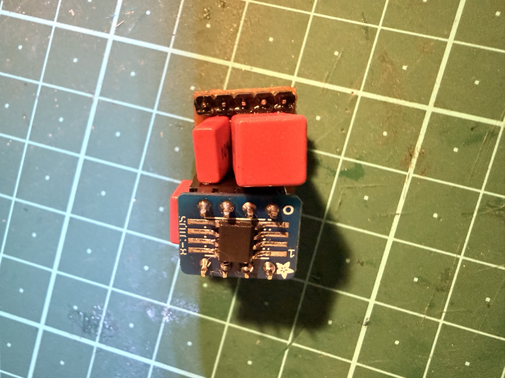
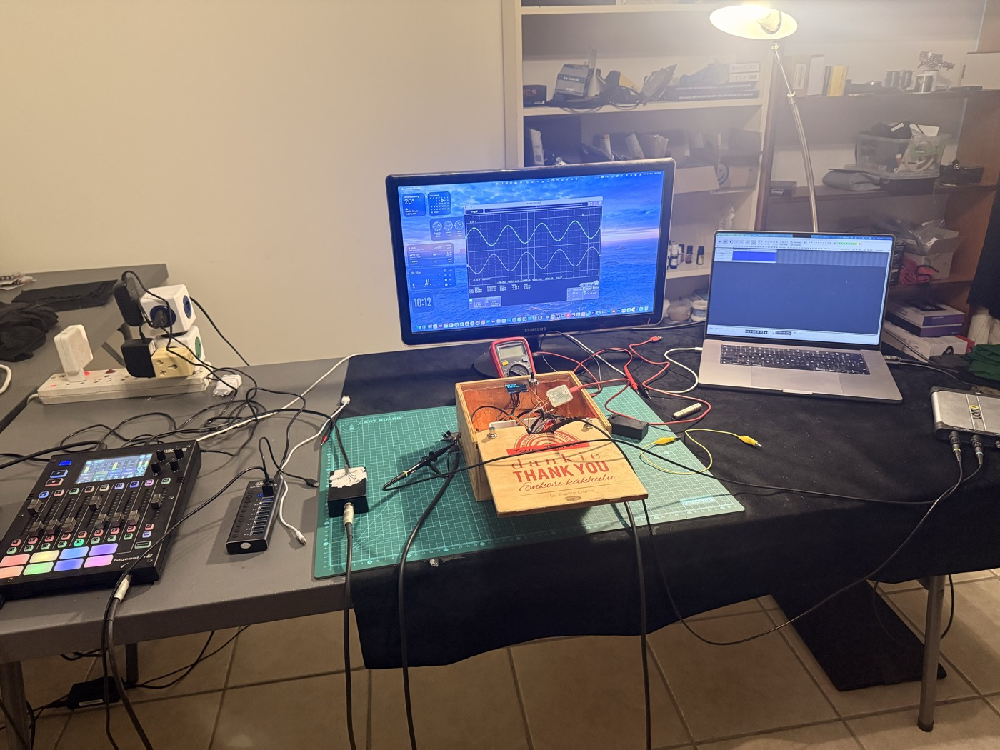

Episode 4 ended with a scorecard, and the scorecard said the humble part won. A single JFET transistor beat a proper audio op-amp on headroom, on distortion, and on hiss. I wrote that up as a lesson in measuring instead of assuming, and I meant it.

There was a footnote I skated over. The op-amp had been fighting with one hand tied.

---

## The Unfair Fight

Every op-amp has a range of input voltages it is actually *promised* to work across. Stay inside it and the manufacturer stands behind the numbers. Step outside and you're on your own — the part will probably still work, but nothing is guaranteed any more.

Ours wants its input to sit at least three and a half volts below its positive supply. In July it was running off the pedal's regulated **5 volt** rail, with its input parked in the middle, at 2.5 V. That's a whole volt outside the band.

It worked. Sound came out. And it distorted at nearly **9%**, which was the receipt.

I knew this when I published. I ran the comparison anyway, on the reasoning that a part which only behaves on a rail I wasn't using is still a part that loses. That reasoning was lazy. The pedal has **9 volts** arriving at the socket — I was only feeding the front end 5 V because that's what everything else on the board ran on. The op-amp had never been given the conditions it was designed for.

So I gave it them, and ran the whole comparison again.

## The Evidence

Both boards rebuilt for a 9 V supply. The op-amp needed no new parts, just more rail — and its gain stripped back to nothing, since Episode 4's hardest lesson was that gain in front of the converter is a liability, not a feature. Same test tone, same jig, same afternoon.

That's one chip, one tone, one board. The only thing that changed between the two traces is the supply voltage.

Those evenly spaced spikes on the 5 V trace are the distortion — extra tones the circuit invents that were never in the signal. On 9 V they're simply gone, dropped by around fifty decibels into the noise. **8.9% became 0.036%.** Roughly two hundred and fifty times cleaner.

The op-amp had never been a bad part. It had been a good part I was abusing.

## The Rematch Scorecard

With that corrected, the July result inverts almost completely.

| | Headroom | Distortion | Hiss | Mains hum |
|---|:---:|:---:|:---:|:---:|
| **JFET** | tie | 0.058% | — | ✗ |
| **Op-amp** | tie | **0.036%** | **✅ 3 dB quieter** | ✅ |

The hiss result has a nice twist in it. The JFET's extra noise doesn't come from the transistor — it comes from the two large resistors that hold its input at the right voltage. They have to be large, or they'd load down the pickup and dull the guitar. So the noise isn't a flaw in the device; it's the rent you pay for the high impedance a piezo needs. Real, and unavoidable in that topology.

## The Tie Is the Interesting Part

Headroom came out level, and not roughly level: the two boards stop at **1.363 V and 1.350 V**. Under a tenth of a decibel apart.

That's because neither buffer is what stops them. The converter is. Both front ends hand over a clean signal right up to the point where the chip *receiving* it runs out of room, and then that chip clips, and nothing either buffer does changes it.

Which is exactly the conclusion Episode 4 reached, arrived at from the opposite direction. The ceiling isn't set by the component you're arguing about. I spent two episodes learning that lesson twice.

## What Actually Decided It

Here's the part I didn't expect, and the part that matters most if this is ever going to be a product rather than a project.

Even if the JFET had won on the numbers, I had a problem with it.

JFETs vary. Not slightly — enormously, from one to the next, even within the same part number from the same shop. The resistor that sets the transistor's operating point has to be chosen to suit *that individual transistor*. This project has been through **three different JFETs, and every one of them needed its own resistor value, found by putting a meter on the part.** One batch turned out so far off that the circuit pinned itself against the supply and passed nothing at all; it had to be abandoned and a different transistor sourced. At one point I ended up with two physically identical parts on the bench and no way to tell which was the one I'd characterised.

On a bench, with a socket and a meter, that's an evening's work and mildly interesting. It is completely fine.

It is not fine the moment somebody else is building the boards. A contract assembler picks parts off a reel and places them by machine. Nobody stops to measure a transistor and select a resistor to match. A circuit that needs hand-tuning per unit isn't a circuit you can hand over — it's a circuit that keeps you personally employed forever, one board at a time.

The op-amp doesn't do this. You fit it and it does what the datasheet says. Every one of them, every time.

So the question quietly stopped being *which one measures better* and became **which one measures the same every time.** That's a different question, and it's the one that decides whether a thing you built stays a thing you built.

## What It Takes To Believe a Measurement

Getting to those numbers took three days, and most of that time wasn't spent measuring the boards at all.

The pedal's compressor was left switched on for one set of readings — and a compressor turns quiet things up and loud things down, which is *precisely* the signature I was hunting for in the buffer. It manufactured the fault I was looking for. A scope probe that hadn't been adjusted invented a one-decibel loss in a board that turned out to be perfect, and sent me looking for a defect that was never there. And the pedal's own tuner display, doing nothing worse than refreshing, leaked enough electrical noise into that deliberately ultra-sensitive input to triple the distortion reading.

Every one of those produced a believable, confident, wrong answer.

None of them were solved by being cleverer about the circuit. They were solved by controls: measure the same thing twice with exactly one variable moved, and check the instrument before you believe what it tells you about the board. That's the unglamorous majority of what "testing a front end" actually means, and it's the difference between a number you can publish and a number you merely wrote down.

## Where This Goes

The op-amp is the front end now. A revised board with the corrected bias built in is next.

And the other thing on the bench is a new brain — a Daisy Seed 3, built around a far quieter converter than the one I've been using.

That changes the stakes rather than the plan. Today the front end sits only about three decibels above the noise of everything measuring it, which is uncomfortably little room to judge anything by. Drop the converter's floor and that margin opens up — the buffer stops being one contributor among several and becomes *the* thing setting how quiet the pedal can be.

Which means the buffer I just spent two episodes arguing about is about to get a much harder exam.

The JFET isn't a bad circuit, for the record. On a 5 V rail it was the right call and I'd make it again. It lost a fair fight — which is all I ever wanted from the measurement, and considerably more than I got the first time.

---

Source, schematics, and firmware: [github.com/dylangmiles/pico-tone-trixter](https://github.com/dylangmiles/pico-tone-trixter)
